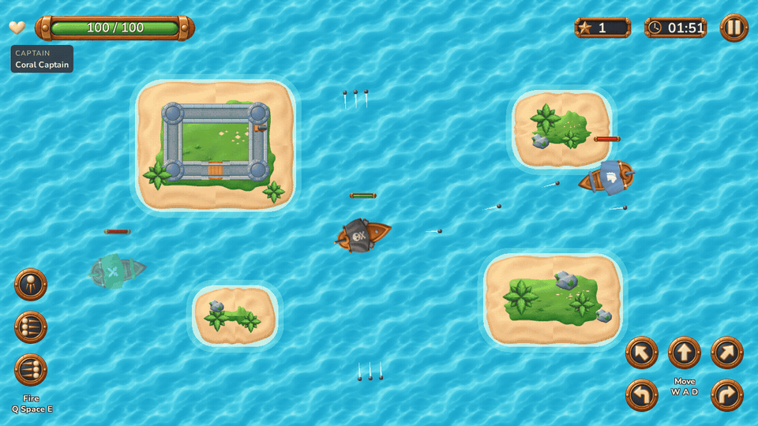
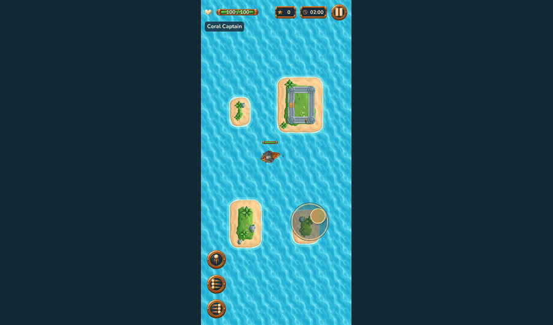
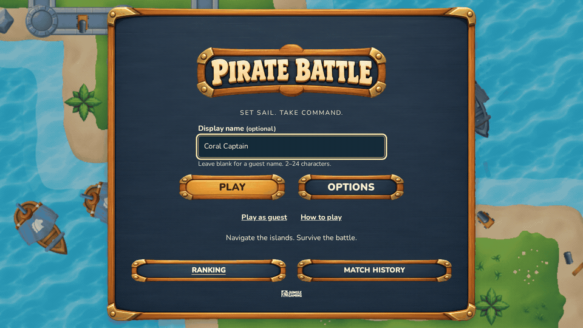

# Pirate Battle

**A browser naval shooter for the Jungle Gaming Frontend Game Developer challenge.**

Sail through a four-island archipelago, line up your cannons and survive Chasers and Shooters. Built with React, strict TypeScript and PixiJS, with keyboard and touch controls, persistent match results and reproducible REST failure scenarios.

**[Play the game](https://pirate-battle-three-gray.vercel.app)** · [Architecture](ARCHITECTURE.md) · [Tests & profiling](https://github.com/KingDonRush/pirate-battle/releases/tag/v1.1.0) · [Challenge brief](CHALLENGE.md)



_Recorded from the published game using its real controls and combat rules. Silent clips; [open a still image](docs/media/overview.webp) or see the [recording details](docs/media/README.md)._

## Try it first

The [public demo](https://pirate-battle-three-gray.vercel.app) opens without an account, API key or private service.

1. Enter an optional captain name and choose **Play**, or use **Play as guest**.
2. Use **W + A/D** to sail and steer, **Space** for the front cannon and **Q/E** for the broadsides. On touch screens, drag anywhere clear of the HUD and hold a cannon with another finger.
3. Open **Options** to change the match, controls, audio or reduced motion. **Demo Network** lets you inspect loading, failures and recovery without interrupting combat.

Ranking and Match History use real Axios requests intercepted by MSW. Their records are **local to each browser and origin**, including the hosted demo; fixture captains provide example ranking data.

## The game

| Area              | Implemented behavior                                                                                                                                                                                            |
| ----------------- | --------------------------------------------------------------------------------------------------------------------------------------------------------------------------------------------------------------- |
| Naval combat      | Forward movement and bounded rotation; one front cannon and two independent three-projectile **parallel** broadsides; swept impacts, cooldowns, damage and exactly one point per player kill.                   |
| Enemy behavior    | **Chasers** pursue and explode on contact without awarding a point. **Shooters** approach and fire when range, heading and line of sight allow it. Both navigate around islands and spawn away from the player. |
| Readable feedback | Health bars on every ship, distinct enemy sail families, progressive damage, white projectile trails, impacts, explosions and Web Audio cues. Defeat and Time up have separate ending presentations.            |
| Responsive play   | Full-viewport water, four shared coastline contours and a fixed outer passage. Portrait, landscape and inverted orientation rotate the whole world uniformly; a brief validated freeze preserves combat state.  |
| Complete journey  | Named/guest play, contained menus, five Options tabs, manual and focus/visibility pause, immutable results, clean replay, paginated records and recoverable saves.                                              |
| Accessibility     | Semantic HUD, labelled forms and errors, keyboard tabs, modal focus management, visible focus, large touch targets and reduced motion. The timer does not announce every tick.                                  |

### Touch and orientation

The floating stick starts where you touch. **Direction** turns the ship toward the drag; **Throttle & Rudder** uses upward drag for forward throttle and horizontal drag for steering. Both preserve the ship's turn-speed limit. Cannons default to the left; **Mirror touch controls** moves them to the right.



_[Portrait still](docs/media/touch-portrait.webp). This recording uses browser touch/orientation emulation; it is not a physical-device test._

### Menus and recovery

Options keeps one draft across **Game**, **Controls**, **Audio**, **Accessibility** and **Demo Network**. Save validates the draft; Cancel discards it. The clip shows an actual ranking failure followed by recovery through the same Axios/Query/MSW path used in play.



_[Menu still](docs/media/menus.webp). Long settings, help and record lists scroll inside the panel while the main actions remain accessible._

## Run locally

Use **Node 22.21.1** and **npm 10.9.4**. Versions are pinned in `.nvmrc`, `package.json` and the lockfile.

```sh
git clone https://github.com/KingDonRush/pirate-battle.git
cd pirate-battle
npm ci
npm run dev
```

Open the Vite URL printed in the terminal. **No environment variables or private services are required.** The mock worker initializes independently of the menu and local game.

```sh
npm run build
npm run preview
```

The default preview port is `4173`. To use another port: `npm run preview -- --port 4175`.

### Controls and settings

| Action                 | Keyboard  | Touch                                |
| ---------------------- | --------- | ------------------------------------ |
| Sail forward           | W / ↑     | Drag the floating stick              |
| Rotate                 | A/D / ←/→ | Direction or Throttle & Rudder       |
| Front cannon           | Space     | Hold the single cannon               |
| Left / right broadside | Q / E     | Hold the corresponding triple cannon |
| Pause / resume         | Escape    | Pause / Resume                       |

Keyboard and touch can act simultaneously. Pause, lost focus, hidden tabs, reflow and pointer cancellation release held input. Returning to the page requires **Resume**; Escape resumes from Pause or cancels paused Options/leave confirmation back to Pause.

| Setting           | Default   | Accepted values               |
| ----------------- | --------- | ----------------------------- |
| Game session time | 120 s     | 60–180 whole active seconds   |
| Enemy spawn time  | 3 s       | 0.75–10 s, in 0.25 s steps    |
| Touch steering    | Direction | Direction / Throttle & Rudder |
| Cannon placement  | Left      | Left / mirrored right         |

Audio gains, mute and reduced motion are also saved. Names accept 2–24 perceived characters; a stable player ID keeps history when the name changes. Each match retains its starting name and complete combat configuration. Combat edits during pause apply to the **next** match; saved audio/control preferences apply when resuming. Reloading an active match abandons it without a record.

## Technical decisions

| Technology               | Responsibility                                                                                             |
| ------------------------ | ---------------------------------------------------------------------------------------------------------- |
| React 19 + TypeScript 6  | Semantic menus, forms, dialogs, HUD and typed boundaries.                                                  |
| PixiJS 8                 | Terrain, ships, health bars, projectiles and effects; asynchronously owned renderer lifecycle.             |
| TanStack Query 5 + Axios | Paginated queries, mutations, cancellation, invalidation, retry policy and transport error classification. |
| MSW 2 + IndexedDB        | Shared browser/Node REST handlers, deterministic failure plans, canonical records and a durable outbox.    |
| Playwright + Vite        | Real-input browser journeys, reviewed visual regressions, optimized builds and profiling.                  |
| Native Web Audio         | Gesture-based startup, reused decoded buffers, bounded voices and pause/ending ownership.                  |

Four decisions shape the implementation:

- **Simulation independent of rendering.** A seeded TypeScript world owns physics, AI and scoring. The runtime advances fixed 1/60 s steps and interpolates presentation. Normal fractional time is preserved; one stalled frame contributes at most 250 ms, while profiling retains the raw stall.
- **One owner for each lifecycle.** React subscribes to a cached immutable HUD snapshot through `useSyncExternalStore`. The runtime owns input, pause, reflow, its private ticker and disposal; shared textures and audio buffers remain application-owned.
- **One transform for view, input and bounds.** Reflow freezes combat, clears input, replaces obsolete targets and resumes after stable rendered validation. The outer water corridor is present from startup; sailing does not change camera scale.
- **Persist before sending.** Results enter IndexedDB before POST. Same ID and content recover one canonical record; acknowledgement removes only the matching pending item. Query cancellation and database revisions prevent late reads from restoring stale data.

The REST surface is `GET /api/ranking`, `GET /api/players/:playerId/matches` and `POST /api/matches`. Lists show five rows per page. Ranking groups the complete combat configuration, then sorts by score descending, active duration descending, date ascending and ID ascending. Historical records retain their original configuration and fingerprint.

See [ARCHITECTURE.md](ARCHITECTURE.md) for the system order, geometry, ownership, persistence contracts, balance and tradeoffs. Gameplay parameters are centralized in [config.ts](src/game/config.ts).

## Reproduce network failures

Open **Options → Demo Network**, choose a scenario and **Save**.

| Scenarios                                                | What to inspect                                                                         |
| -------------------------------------------------------- | --------------------------------------------------------------------------------------- |
| Success, Empty lists, Multiple pages                     | Normal records, empty states and five-row pagination.                                   |
| Slow responses, Variable latency, Responses out of order | Loading/refetch feedback and protection against stale responses.                        |
| Request timeout, Connection failure, HTTP 400 / 500      | Classified errors, retry behavior and continued access to Play/Options.                 |
| Ranking unavailable, History unavailable                 | Failure isolated to the selected projection.                                            |
| Commit then timeout                                      | A committed result whose acknowledgement is delayed; retries recover its existing ID.   |
| Registration unavailable                                 | A match stays pending through refresh and another match, then registers after recovery. |

To try durable recovery, select **Registration unavailable**, finish a match, inspect the save status, refresh, then select **Success** and Save. The pending result is retried without duplication. Axios times out after 4 s; Query retries transient failures twice after 1/2 s. Validation errors and conflicts do not retry automatically.

Changing a scenario preserves matches. **Reset demo data** requires confirmation and clears this game's records, pending results and latest result while preserving the name and options.

## Verification and evidence

The [v1.1.0 release](https://github.com/KingDonRush/pirate-battle/releases/tag/v1.1.0) identifies the evaluated game source **`88bf86f`**. Its [integrated CI](https://github.com/KingDonRush/pirate-battle/actions/runs/37162451337) passed all source and browser jobs. Documentation and GIFs describe that release; live `build-info.json` identifies the deployed commit independently of later documentation edits.

| Check                                  | Delivered observation                                                                                                                                         |
| -------------------------------------- | ------------------------------------------------------------------------------------------------------------------------------------------------------------- |
| Full local and anonymous hosted suites | **232 passed**, six explicit duplicate/native-CDP skips, zero failures/retries in each run. Chromium desktop/touch, Firefox and a real tab-switch/focus case. |
| Development / React Strict Mode        | **88 passed**, eight explicit bundle-only/native-CDP skips, plus three later native-resize checks.                                                            |
| Visual regression                      | **24 reviewed baselines** for menu, stable arena and real result; desktop, portrait and landscape.                                                            |
| Optimized 180-active-second match      | **60.0022 FPS**, **17.40 ms p95** raw frame interval; both enemy types, normal combat and Time up.                                                            |
| Five comparable play/exit cycles       | Session owners and voices released; unique Runtime/Scene owners absent after GC. Heap growth investigated, with 91.99% explained by compiled-code self size.  |
| Published artifact                     | All **67 file hashes**, source metadata, initial/reload, worker, cache headers and missing-resource response checked.                                         |

Performance was measured on **Intel i5-12600K / NVIDIA RTX 4060 Ti**, Chromium 151, WebGL2 through ANGLE Vulkan, **1800 × 1000 / DPR 1**, seed 38 and standard 3 s spawns. The method, raw metrics and finite limits are in [profiling](docs/profiling.md).

Download and extract the [evidence ZIP](https://github.com/KingDonRush/pirate-battle/releases/download/v1.1.0/pirate-battle-v1.1.0-evidence.zip). Open `evidence/public/report/index.html` for the hosted suite or `profiling/report/index.html` for profiling. The package includes useful labelled failure traces, selected frames, baselines, source manifests and a SHA-256 checksum.

### Commands

```sh
npm run browser:install
npm run lint
npm run typecheck
npm run format:check
npm run check:structure
npm run build
E2E_PORT=4175 npm run test:e2e
E2E_PORT=5174 npm run test:e2e:dev
npm run test:e2e:report
E2E_PORT=4175 npm run profile
```

`npm run check` runs structure, lint, types, formatting, build and the full browser suite. On Linux, headed focus checks need a display: `xvfb-run -a env E2E_PORT=4175 npm run check`. CI isolates four browser projects across five jobs, splitting mobile into two shards; protected `verify` requires every job to pass.

Optional test variables are `E2E_PORT`, `E2E_SERVER=dev` and `E2E_BASE_URL`. For example, `E2E_BASE_URL=https://pirate-battle-three-gray.vercel.app npm run test:e2e` targets the published game without a local server. `?seed=42` selects reproducible randomness; `?clock=manual` enables the same simulation's diagnostic clock. Instrumentation observes state and advances time; it cannot assign health, score, positions or completion.

### Scope and limits

Device emulation is not physical-device testing. Test browsers mute their output while real Web Audio nodes run; subjective listening was not performed. The declared 180 s workload and five resource cycles are finite samples, not worst-case or indefinite-retention guarantees. Supplied static references guide artwork and composition; they do not provide an original animation timeline.

## Project guide

| Path                                                                      | Purpose                                                                            |
| ------------------------------------------------------------------------- | ---------------------------------------------------------------------------------- |
| [src/game](src/game)                                                      | Simulation, geometry, navigation, runtime, renderer, audio and reflow.             |
| [src/ui](src/ui)                                                          | React screens, dialogs, touch controls and record views.                           |
| [src/data](src/data) / [src/mocks](src/mocks)                             | REST contracts, Axios/Query integration, IndexedDB, shared handlers and scenarios. |
| [tests/e2e](tests/e2e) / [tests/profiling](tests/profiling)               | Real-input journeys, versioned baselines and measurement protocols.                |
| [Acceptance](docs/acceptance.md) / [Visual review](docs/visual-review.md) | Challenge mapping and reference presentation review.                               |
| [Deployment](docs/deployment.md) / [Assets](docs/assets.md)               | Public artifact correspondence, supplied artwork, sound and licenses.              |

Built by [Guilherme Manoel da Silva](https://github.com/KingDonRush) for the [Jungle Gaming challenge](https://github.com/junglegaming/game-developer-challenge). The supplied artwork and WAVs remain the visual/audio foundation; the complementary Nunito font includes its SIL Open Font License. [Full attribution](docs/assets.md).

<!-- **Read contract:** Solution documentation and release-bound evidence. CHALLENGE.md governs requirements; .agents/index.md routes agent work. GitHub Issues/CI own current task state. This README is the evaluator entry point, not authorization or a live task ledger. -->
